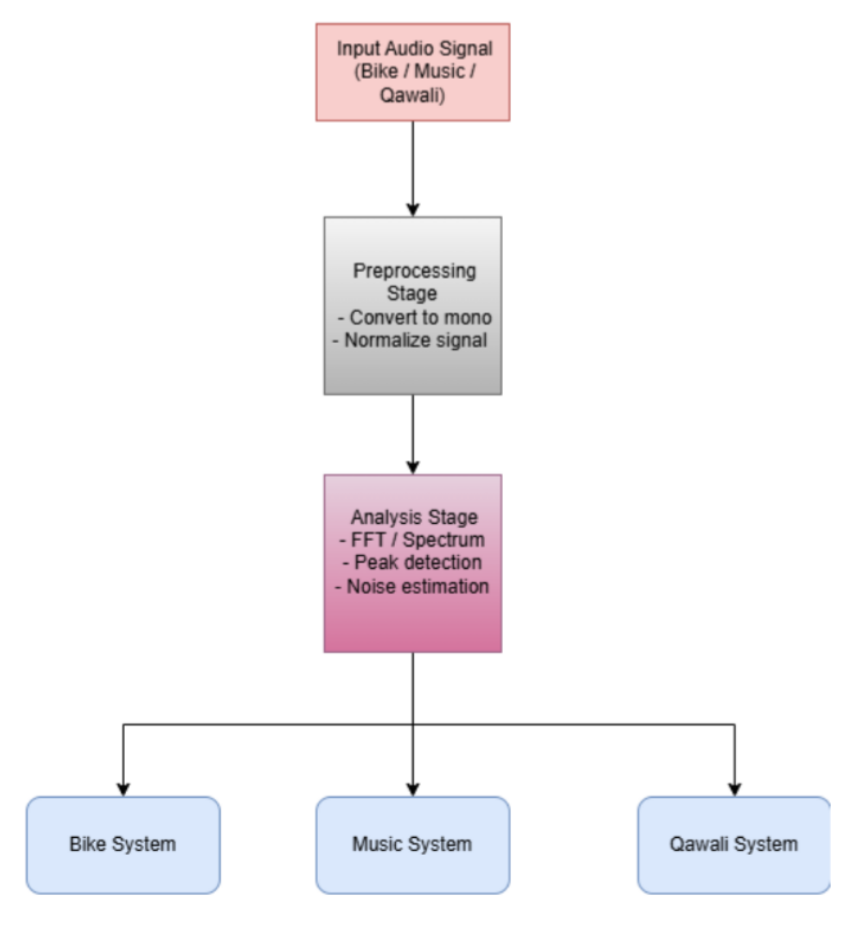
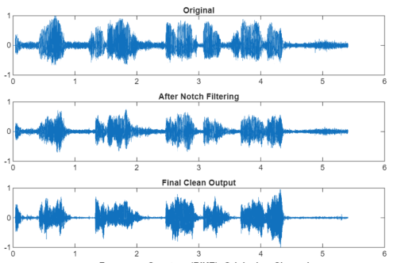
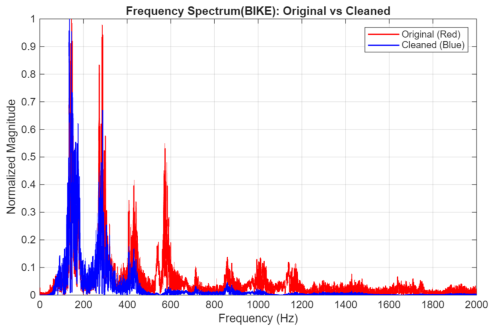
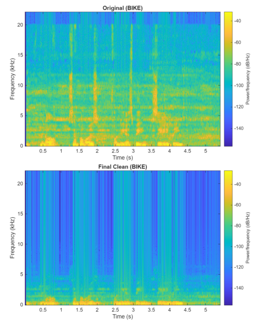
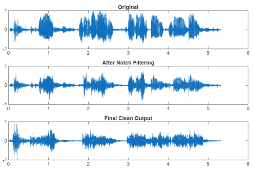
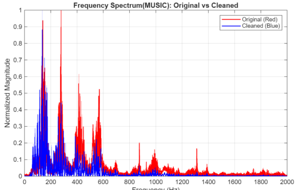
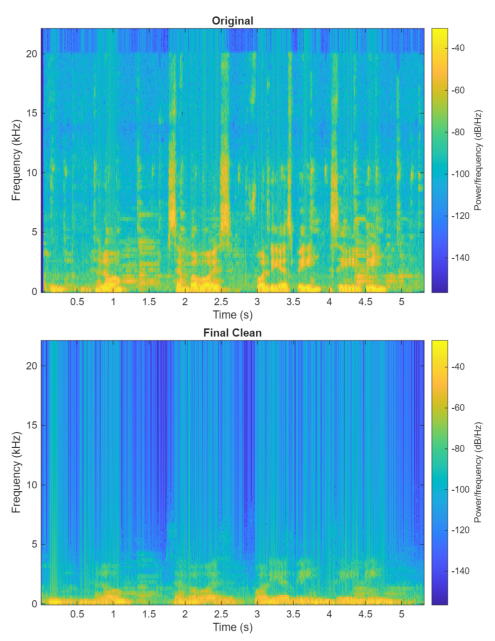
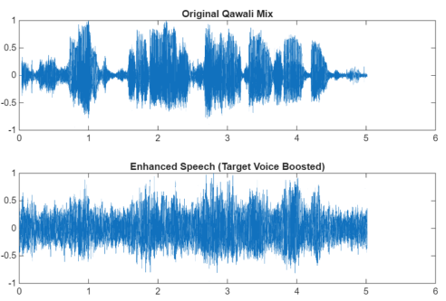
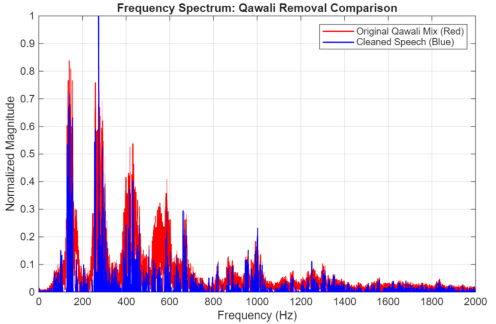
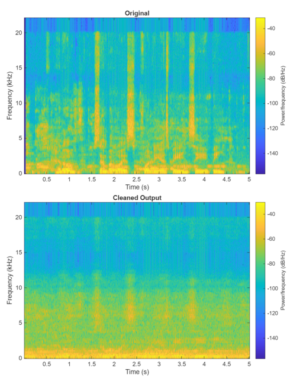

# Audio Noise Reduction Using MATLAB DSP Techniques


This project focuses on reducing real-world background noise from speech recordings using classical DSP techniques in MATLAB. Three different noise environments were analyzed and processed independently:

- Motorcycle / Engine Noise
- Music Background Noise
- Qawali Background Noise

Unlike machine-learning-based approaches, this project relies entirely on signal processing techniques such as:

- FFT-based spectral analysis
- Peak frequency detection
- IIR Notch Filters
- Butterworth Bandpass Filtering
- Moving-Average Smoothing
- Spectral Subtraction

The objective is to improve speech intelligibility while preserving the desired voice signal.


---

# Repository Structure

# File Structure

```text
├── docs
│   ├── bike_fft.png
│   ├── bike_s.png
│   ├── bike_t.png
│   ├── block_diagram.png
│   ├── music_f.png
│   ├── music_s.png
│   ├── music_t.png
│   ├── qawali_f.png
│   ├── qawali_s.png
│   └── qawali_t.png
│
├── LICENSE
│
├── motorcycle
│   ├── results
│   │   ├── bike_fft.png
│   │   ├── bike_s.png
│   │   ├── bike_t.png
│   │   └── output_check_freq.txt
│   └── src
│       ├── check_freq.m
│       └── main.m
│
├── music
│   ├── results
│   │   ├── music_f.png
│   │   ├── music_s.png
│   │   ├── music_t.png
│   │   └── output_check_freq.txt
│   └── src
│       ├── check_freq.m
│       └── main.m
│
├── qawali
│   ├── results
│   │   ├── qawali_f.png
│   │   ├── qawali_s.png
│   │   └── qawali_t.png
│   └── src
│       └── main.m
│
├── README.md
└── report
    └── DSP_Audio_Reduction_Report.pdf
```

---

# Processing Pipeline

The following block diagram summarizes the complete audio noise reduction workflow implemented in this project.

<p align="center">
  
</p>

The workflow consists of:

1. Audio Acquisition
2. Stereo-to-Mono Conversion
3. Normalization
4. FFT-Based Spectral Analysis
5. Peak Frequency Detection
6. Noise-Specific Processing
7. Output Audio Reconstruction
8. Visualization and Analysis

---

# Noise Scenarios

The project investigates three different real-world noise environments.

---

# 1. Motorcycle Noise Reduction

Motorcycle engine noise is highly periodic and harmonic in nature.

The processing chain used:

- FFT Analysis
- Harmonic Peak Detection
- IIR Notch Filter Bank
- Butterworth Bandpass Filter (80–3400 Hz)
- Moving-Average Smoothing

### MATLAB Files

```text
motorcycle/src/
├── check_freq.m
└── main.m
```

### Workflow

#### Step 1 — Frequency Analysis

[check_freq.m](motorcycle/src/check_freq.m)

- Reads audio
- Computes FFT
- Finds strongest spectral peaks
- Identifies dominant engine harmonics

##### Output

[output_check_freq.m](motorcycle/results/output_check_freq.txt)


#### Step 2 — Noise Reduction

[main.m](motorcycle/src/main.m)

- Applies multiple notch filters
- Removes engine harmonics
- Applies speech bandpass filter
- Performs smoothing
- Generates plots
- Saves cleaned audio

---

## Motorcycle Results

### Time-Domain Comparison

Original vs Cleaned Audio

<p align="center">
  
</p>

---

### FFT Spectrum Comparison

Original vs Cleaned Audio

<p align="center">
  
</p>

---

### Spectrogram Comparison

Original vs Cleaned Audio

<p align="center">
  
</p>

---

# 2. Music Background Noise Reduction

Music is considerably more challenging because its harmonics overlap with human speech frequencies.

The processing chain used:

- FFT Analysis
- Peak Detection
- Dense Notch Filter Bank
- Butterworth Bandpass Filtering
- Wide Moving-Average Smoothing

### MATLAB Files

```text
music/src/
├── check_freq.m
└── main.m
```

### Workflow

#### Step 1 — Frequency Analysis

[check_freq.m](music/src/check_freq.m)

- Performs FFT
- Detects dominant musical harmonics
- Extracts strongest peaks


##### Output

[output_check_freq.m](music/results/output_check_freq.txt)

#### Step 2 — Noise Reduction

[main.m](music/src/main.m)

- Creates a dense notch-filter bank
- Removes detected harmonic components
- Preserves speech frequencies
- Smooths residual artifacts
- Generates plots

---

## Music Results

### Time-Domain Comparison

Original vs Cleaned Audio

<p align="center">
  
</p>

---

### FFT Spectrum Comparison

Original vs Cleaned Audio

<p align="center">
  
</p>

---

### Spectrogram Comparison

Original vs Cleaned Audio

<p align="center">
  
</p>

---

# 3. Qawali Background Noise Reduction

Qawali presents the most difficult scenario because:

- Multiple singers
- Tabla harmonics
- Harmonium components
- Dense broadband spectral content

Traditional notch filtering becomes ineffective due to significant overlap between speech and background music.

Therefore, a different approach is used.

### MATLAB File

[main.m](qawali/src/main.m)


### Processing Method

The Qawali implementation uses:

- Full FFT Analysis
- Noise Spectrum Estimation
- Spectral Subtraction
- IFFT Reconstruction
- Post Processing Smoothing

### Workflow

1. Compute FFT
2. Estimate background spectral envelope
3. Perform spectral subtraction
4. Reconstruct signal using original phase
5. Apply light smoothing
6. Normalize output

---

## Qawali Results

### Time-Domain Comparison

Original vs Cleaned Audio

<p align="center">
  
</p>

---

### FFT Spectrum Comparison

Original vs Cleaned Audio

<p align="center">
  
</p>

---

### Spectrogram Comparison

Original vs Cleaned Audio

<p align="center">
  
</p>

---

# Techniques Used

| Technique | Motorcycle | Music | Qawali |
|------------|------------|--------|---------|
| FFT Analysis | ✅ | ✅ | ✅ |
| Peak Detection | ✅ | ✅ | ❌ |
| IIR Notch Filters | ✅ | ✅ | ❌ |
| Butterworth Bandpass | ✅ | ✅ | ❌ |
| Moving-Average Smoothing | ✅ | ✅ | ✅ |
| Spectral Subtraction | ❌ | ❌ | ✅ |
| IFFT Reconstruction | ❌ | ❌ | ✅ |

---

# Key DSP Concepts Demonstrated

This project demonstrates practical implementation of:

- Digital Audio Processing
- FFT-Based Spectral Analysis
- Frequency-Domain Noise Identification
- IIR Filter Design
- Notch Filter Cascading
- Butterworth Filter Design
- Speech Enhancement
- Spectral Subtraction
- Time-Domain Signal Analysis
- Frequency-Domain Signal Analysis
- Spectrogram Interpretation

---

# Requirements

Software required:

- MATLAB R2020a or later


---

# Notes

- Audio recordings are intentionally not included in this repository.
- Users may test the scripts using their own recordings.
- The generated plots shown above were obtained using the original recordings used during project development.
- Each scenario uses a processing pipeline tailored to the characteristics of its respective noise source.

---

# Detailed Report

A complete report containing:

- Theory
- Mathematical Background
- Block Diagrams
- MATLAB Code
- Line-by-Line Explanations
- Frequency Analysis
- Experimental Results
- Discussion
- References

can be found here:

 **[DSP Report](report/DSP_Audio_Reduction_Report.pdf)**

---

# License

This project is licensed under the Apache License 2.0.

See the [LICENSE](LICENSE) file for details.

---

# Author

**Muhammad Waleed Akram**

Electrical Engineering Department

University of Engineering & Technology (UET), Lahore

